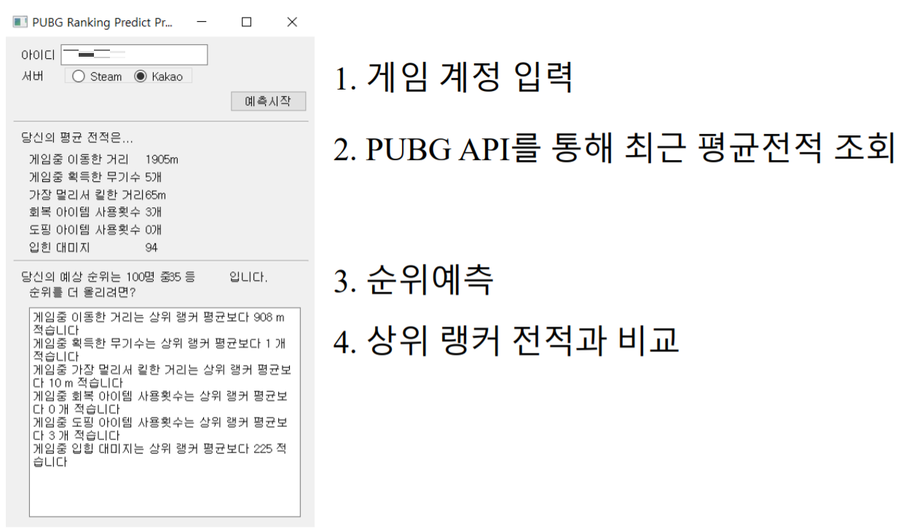

# PUBG-Finish-Placement-Prediction-Challenge  
이 프로젝트는 2018년도 상명대학교 마이크로튜터링 활동 결과물 프로젝트 입니다.

사용자의 PUBG 계정을 입력받아 전적을 조회하고  
미리 학습된 모델을 이용하여 사용자의 평균 전적을 예측하는 프로그램입니다.

# Requirements  
* 코드를 사용하기 위해서는 PUBG API KEY가 필요합니다.  
  API KEY는 다음 URL에서 얻을 수 있습니다.  
  > https://developer.pubg.com/ 
  API KEY를 획득했다면 functions.py 코드의 player_data_collect 함수의 api_key 변수에 입력해 주어야 합니다.  
  개인용 API KEY를 사용하기 때문에 자신의 API KEY를 직접 입력해야 합니다.  
  또한 과도한 요청시 일시적으로 API KEY가 사용할 수 없게 될 수 있으니 주의하시길 바랍니다.
  
* 코드를 사용하기 위해서는 모델 파일이 필요합니다.  
  저희 프로젝트에서 기 학습시킨 모델 파일은 아래 주소에서 다운로드 받으실 수 있습니다.  
  > https://bit.ly/34fEIUY/  
  파일의 기본 경로는 프로젝트 폴더 내부의 medelfile.pkl 입니다.  
  경로 변경이 필요하실 경우 PUBG_Prediction.py 코드에서 변경할 수 있습니다.  
  
* 필요한 패키지는 requirements.txt 파일에 명시되어 있습니다.  


# Quick Start
* API KEY와 모델 파일이 모두 준비되어 있다면 아래 명령어로 프로그램을 시작할 수 있습니다.
```
pip install -r requirements.txt  
python PUBG_Prediction.py
```

* 아래 이미지와 같이 동작합니다.  



# 참고사항  
* 코드는 Python 3.5 버전을 기준으로 작성되었습니다.  
* 각 코드 설명  
```
PUBG_Prediction.py : Main code 입니다.  
functions.py : 함수 코드입니다.  
mainwindow_ui.py : UI 구성 코드입니다. PyQt5로 작성되었습니다.  
model_training.py : 모델 학습에 사용된 코드입니다.
                    실제 동작에는 영향이 끼치지 않는 참고용입니다.
                    Kaggle kernal에서 동작하게 작성되었습니다.
```  
* 본 프로젝트는 Kaggle의 PUBG Finish Placement Prediction 챌린지에 참가하여 진행되었습니다.  
  > https://www.kaggle.com/c/pubg-finish-placement-prediction/  
* 아래는 2018년 상명대학교 프라임학과 경진대회 마이크로튜터링 부문 참가용으로 작성된 논문형식 보고서입니다.
  > http://bit.ly/35x4QLj
  

